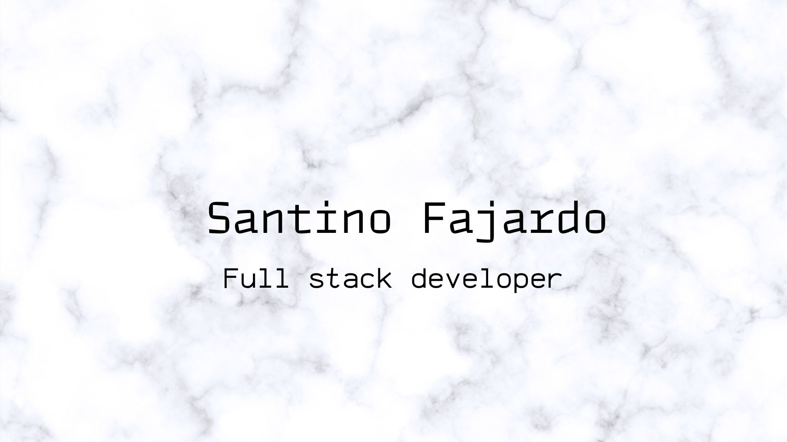

 

<h1>💎About me </h1>
🚀Soy un desarrollador de software, tengo stack en backend y en frontend, lo que me permite poder desarrollar aplicaciones y buscar informacion de forma independiente en ambos sectores.
 
 
🧑‍🤝‍🧑Me forme en Henry Bootcamp, donde fui Teaching Assistant, lidere un grupo de estudiantes para poder ayudarlos a que alcancen sus objetivos de la forma mas eficiente posible.
 
 

💻 Me encanta afrontar nuevos desafios todos los dias para poder ganar experiencia y avanzar todos los dias. Soy proactivo, organizado y siempre busco salir de mi zona de confort para siempre ser mejor cada dia.

 

<h1>🧑‍💻 MIS SKILLS</h1>

<h2 font-size="40px">FRONT-END:</h2>

 

<h2 font-size="40px">BACK-END:</h2>

 

<h2 font-size="40px">BASES DE DATOS:</h2>

 

<h2 font-size="40px">OTROS:</h2>

 

<h1 font-size="40px">📈GitHub Estadisticas</h1>

 

<h1 font-size="40px">🏆Trofeos de GitHub</h1>

 

<h1>🫂Contact</h1>

Si te interesaria saber mas sobre mi poder contactarme, en las siguientes plataformas, te respondere con gusto!

 

🔗 Gmail: santinofajardo02@gmail.com  
🔗 Linkedin : https://www.linkedin.com/in/santino-fajardo-810a61235/  
📱+54 3487-707459

